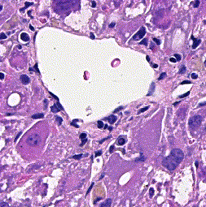
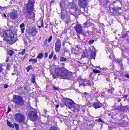

# Image-to-image translation methods for stain transfer in histopathology

----------------

This repository accompanies Zingman et al. [A comparative evaluation of image-to-image translation methods for stain transfer in histopathology](https://arxiv.org/abs/2303.17009) ([MIDL, 2023](https://2023.midl.io/)). The paper analyses strengths and weaknesses of image-to-image translation methods for stain transfer in histopathology, thereby allowing a rational choice of the most suitable approach.

  

Project Organization
--------------------

    ├── README.md                               <- The top-level README for developers using this project.
    │
    ├── config.yaml                             <- Default yaml configuration file for inference experiments.
    │
    ├── data                                    <- Directory for input data.
    │
    ├── models                                  <- Trained and serialized models.
    │
    ├── results                                 <- Generated images and metrics are saved here.
    │
    ├── requirements.txt                        <- The requirements file for reproducing the analysis environment, e.g. generated with `pip freeze > requirements.txt`
    │
    ├── src                                     <- Source code for use in this project.
    │   │
    │   ├── data_processing                     <- Data manipulation functionalities.
    │   │
    │   ├── modelling                           <- Model arquitectures and definitions.
    │   │
    │   ├── tests                               <- Tests directory.
    │   │
    │   └── utils                               <- Utilities used by other scripts.
    │
    ├── main.py                                 <- Main execution file, used for generating fake images and for calculating metrics.
    │
    ├── metric_calculation.py                   <- Calculates FID, WD, and SSIM metrics for generated images
    │
    └── visualizer.py                           <- Tool for visualizing generated fake images and inspecting metrics.

Prerequisites
-------------

- Linux or macOS
- Python 3.7 +
- CPU or NVIDIA GPU + CUDA CuDNN

Installation
------------
Create a working environment, with e.g. conda and activate it.
It is recommended not to use virtualenv as there are problems with the spams library.

Clone this repository: ```git clone https://github.com/Boehringer-Ingelheim/stain-transfer```

Install spams: `conda install -c conda-forge python-spams`.

Install the required modules `pip install -r requirements.txt`.

Getting started
---------------
Download trained models and test or validation histopathological dataset from https://osf.io/byf27/.
Trained models can be saved in ```models/``` folder, H&E stained samples and Masson's trichrome stained samples 
from the dataset can be saved in ```data/he/``` and ```data/masson/``` folders.

- Run `python main.py --conf config_example_he2mt.yaml`, or use a different yaml configuration file 
avaialble in the root folder of the project. This will generate artificially created samples (images with Masson's 
Trichrome artificially stained tissue from images of H&E stained tissue). The detailed description
of the fields in the configuration file is available in ```config.yaml``` 
- Run `python metric_calculation.py --real_source data/he/ --real_target data/masson/ --fakes results/masson_fake/`. 
The given paths correspond to the paths in ```config_example_he2mt.yaml```.  This will
generate excel file with computed FID, WD, and SSIM metrics that evaluate the quality of the
created images of artificially stained tissue. 


[//]: # (Use the `main.py` file and a configuration yaml to generate fake images and also)

[//]: # (to compute and inspect metrics when paired images are available. The results are)

[//]: # (saved in the _results_ directory if a `results_path` is not specified. Here is a)

[//]: # (simple example of a yaml for generating fakes with cyclegan:)

[//]: # ()
[//]: # (```yaml)

[//]: # (generate:)

[//]: # (  models:)

[//]: # (    names: [ cyclegan ])

[//]: # (    weights: [ models/cyclegan_he2mt.pth ])

[//]: # (  a2b: true)

[//]: # (  batch_size: 2)

[//]: # (  data_path: data/processed/HE/)

[//]: # (  results_path: fakes)

[//]: # (  device: -1)

[//]: # (  num_workers: 4)

[//]: # (metrics:)

[//]: # (  classic_metrics: [ ssim ])

[//]: # (  source: data/processed/HE/)

[//]: # (  fake: fakes/CycleGan)

[//]: # (```)

[//]: # ()
[//]: # (Launch executions in this order:)

[//]: # ()
[//]: # (1. `python main.py --conf config.yaml --generate` to generate and save images,)

[//]: # (   to a new folder named _fakes/CycleGan_. Note that the name of the model is)

[//]: # (   added as subfolder.)

[//]: # (2. `python main.py --conf config.yaml --metrics` to compute and save SSIM)

[//]: # (   between previously generated fake images &#40;`fake` path field&#41; and the original ones &#40;`source` path field&#41;. Since a)

[//]: # (   `results_path` field is not provided, the metrics are saved to their default)

[//]: # (   location, in _results/statistics_. They are saved because they can later be)

[//]: # (   used with the visualizer.)

[//]: # ()
[//]: # (A sample configuration yaml &#40;`config.yaml`&#41; is provided as a baseline to conduct)

[//]: # (experiments, with detailed comments to facilitate executions.)


Generating artificially stained samples 
----------------
All parameters for generating fakes are inside the `generate` key in the yaml.
You will find a `models` key here which is for specifying what models to use,
and their associated weights. If `weights` are not provided, then default
weights for each model will be loaded, based on the `a2b` key which specifies
the direction of domain translation. The default weights are located in the
_models_ folder and the name of each file is _model_direction.pth_ where _model_
is the name of the model in lowercase and _direction_ is either _he2mt_ or _
mt2he_. For example, each of the following configuration would be using the same
model and weights file:

<table>
<td>

```yaml
generate:
  models:
    names: [ cyclegan ]
    weights: [ models/cyclegan_he2mt.pth ]
  a2b: true
```

</td>
<td>

```yaml
generate:
  models:
    names: [ cyclegan ]

  a2b: true
```

</td>
</table>
but this one uses a different weights files:

```yaml
generate:
  models:
    names: [ cyclegan ]
    weights: [ retrained.pth ]
  a2b: true
```

You can generate fakes for a given `data_path` using multiple models at once:

```yaml
generate:
  models:
    names: [ cyclegan, cut, munit, macenko, pix2pix, vahadane ]
  a2b: true
  data_path: data/processed/HE/
```

Available models are:

- colorstat
- cut
- cyclegan
- drit
- macenko
- munit
- pix2pix
- staingan
- stainnet
- unit
- utom
- vahadane

### Different inference modes

For munit, drit, colorstat, macenko and vahadane there are different inference
configurations available.

For munit and drit (the higher the number the higher the precedence):

1. The default mode is to generate a random style/attribute tensor (munit/drit)
   and use it when translating between domains.
2. Instead of a random style/attribute tensor (munit/drit), you can provide a
   specific precomputed one by setting the path to such tensor in
   the  `target_tensor` key. This precomputed tensor can be for example, the
   average style/attribute of all images in the target domain.
3. You can also compute style/attribute tensors (munit/drit) on the fly for a
   given set of images by providing the path to the images in `target_path`. The
   number of target images used for each translation will be the same
   as  `batch_size`.

For colorstat, macenko and vahadane (the higher the number the higher the
precedence):

1. The default mode is to use default "weights". These "weights" are actually
   tensors representing averages of all images in our training set for each
   domain. These averages are:
    1. means and standard deviations for colorstat
    2. stain matrix and 99<sup>th</sup> percentile of concentration matrix for
       macenko
    3. stain matrix and 99<sup>th</sup> percentile of concentration matrix for
       vahadane
2. By providing the path to a specific precomputed tensor in
   the  `target_tensor` key.
3. By computing average means and standard deviations or stain matrices and
   corresponding 99<sup>th</sup> percentiles of concentration matrices on the
   fly for a give set of images by providing the path to the images
   in `target_path` and the number of images to be considered in each
   translation in `target_samples`.

You can use inference modes 1. and 3. (default mode and computing tensors on the
fly) with multiple of these models, and other models, from a single
configuration:

```yaml
generate:
  models:
    names: [ cyclegan, cut, munit, macenko, pix2pix, vahadane ]
  a2b: true
  data_path: data/processed/HE/
  target_path: data/processed/masson_trichrome
  target_samples: 2
```

If you are using inference mode 2. (precomputed tensors) for any of these
models, then you can't generate fakes at once from one single configuration file
that includes any two of these models. The configuration on left is wrong, since
this target tensor is a style tensor for munit, and would fail for macenko and
vahadane. The one on the right is valid.

<table>
<td>

```yaml
generate:
  models:
    names: [ cut, munit, macenko, pix2pix, vahadane ]
  a2b: true
  data_path: data/processed/HE/
  target_tensor: precomputed_munit_style_tensor.pth
```

</td>
<td>

```yaml
generate:
  models:
    names: [ cut, munit, pix2pix ]
  a2b: true
  data_path: data/processed/HE/
  target_tensor: precomputed_munit_style_tensor.pth
```

</td>
</table>

Precomputing average tensors
----------------------------

There is also the option to precompute average tensors for all images in a given
path. To do so, specify one of the following models in the configuration yaml:

- colorstataveragetensor: for the given `data_path` computes the average mean
  and std of images.
- macenkoaveragetensor: for the given `data_path` computes the average stain
  matrix and 99th percentile of the concentration matrix of images using macenko
  method.
- vahadaneaveragetensor: same as macenkoaveragetensor but with vahadane method.
- munitaveragetensor: for the given `data_path` computes the average style of
  images. The default munit weights will be used if `weights` is not specified
  in the configuration. When using this model `a2b` key should be specified to
  know if `data_path` contains images from domain A or B.
- dritaveragetensor: same as munitaveragetensor, only that instead of styles,
  attributes are computed.

Computed average tensors will be saved in _results/av_tensors_ folder if no
`results_path` is provided in the configuration. Each model will have its own
sub-folder with computed tensors. The computed tensors can then be set
as `target_tensor` when generating fakes.

[//]: # (Computing metrics between image pairs)

[//]: # (------------------------)

[//]: # ()
[//]: # (Metrics can be computed for paired images. Specify the source and target)

[//]: # (directories containing real images as well as a directory with fake images. You)

[//]: # (can copy fake images from different models to the fake directory and calculate)

[//]: # (metrics across different models at once. )

[//]: # ()
[//]: # (Available metrics are:)

[//]: # ()
[//]: # (- ssim)

[//]: # ()
[//]: # (Visualization Tool)

[//]: # (------------------)

[//]: # ()
[//]: # (Once you have generated fake images and calculated metrics you can inspect and)

[//]: # (compare results with the visualization tool.)

[//]: # ()
[//]: # (Run `python visualizer.py` to launch the visualization tool. Inside this file)

[//]: # (specify the configuration dictionary. A metrics csv file with results generated)

[//]: # (from previous step is needed. Only models and metrics found in this file can be)

[//]: # (inspected. Also specify all desired metrics to inspect.)

Computing SSIM, FID, WD metrics 
--------------------------
Use `metric_calculation.py` to compute the metrics, e.g.:

`python metric_calculation.py --real_source data/he/ --real_target data/masson/ --fakes results/masson_fake/ --device 0`

Provide the following
required arguments:

- real_source: path to real source images (for SSIM)
- real_target: path to real target images (for FID, WD)
- fakes: path to folder containing folders with fake images

A csv with SSIM, FID and WD will be generated.

Results 
--------------------------
Performance of different Image-to-Image translation methods on validation dataset (please, see the details in [A comparative evaluation of image-to-image translation methods for stain transfer in histopathology](https://arxiv.org/abs/2303.17009)).

| Model     | FID $\downarrow$  | WD $\times 10^4$ $\downarrow$   | SSIM $\uparrow$  |
|-----------|-------|-------|-------|
| CycleGAN  | 16.33 | 1.46  | 0.951 |
| CUT       | 17.10 | 1.60  | 0.914 |
| MUNIT     | 19.20 | 1.61  | 0.871 |
| StainGAN  | 19.59 | 3.27  | 0.952 |
| UNIT      | 20.23 | 2.54  | 0.940 |
| UTOM      | 20.64 | 2.32  | 0.952 |
| DRIT      | 22.83 | 2.06  | 0.915 |
| Pix2Pix   | 48.47 | 8.42  | 0.998 |
| StainNet  | 50.49 | 11.41 | 0.972 |
| ColorStat | 62.13 | 9.60  | 0.974 |
| Macenko   | 70.39 | 12.90 | 0.926 |
| Vahadane  | 76.55 | 15.14 | 0.911 |


Citing
----------------------------
```markdown
@inproceedings{
zingman2023a,
title={A comparative evaluation of image-to-image translation methods for stain transfer in histopathology},
author={Igor Zingman and Sergio Frayle and Ivan Tankoyeu and Sergey Sukhanov and Fabian Heinemann},
booktitle={Medical Imaging with Deep Learning},
year={2023},
url={https://openreview.net/forum?id=leVAXRDthXI}
}
```
 
